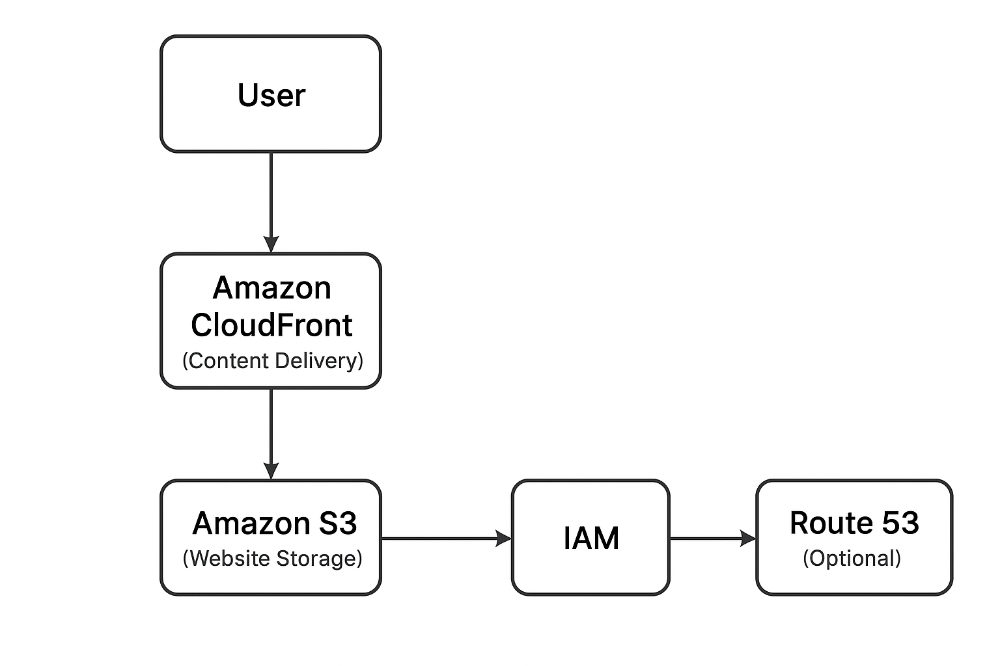

# ☁️ Static Portfolio Website on AWS S3 + CloudFront

---

## 🧠 Overview
This project demonstrates how to **host and distribute a static portfolio website** using **Amazon S3** and **Amazon CloudFront**.  
It showcases fundamental AWS skills — from S3 static website hosting, permission management with IAM and bucket policies, to CDN distribution with CloudFront.

It was built as part of my Cloud & DevOps learning journey while preparing for the **AWS Certified Cloud Practitioner** exam.  
  
It focuses on building hands-on cloud experience while managing cost effectively.

---

## 🏗️ Architecture Diagram


**Architecture Summary:**
1. **User** requests access to the website via a browser.
2. **Amazon CloudFront (CDN)** delivers cached website content from the nearest edge location.
3. **Amazon S3** acts as the origin, storing static website files (HTML, CSS, JS, and images).
4. **IAM** manages access and permissions for S3 and CloudFront.
5. **(Optional)** **Route 53** provides DNS routing for a custom domain name.

---

## ⚙️ Technologies & Tools Used

| Category | Tool / Service |
|-----------|----------------|
| Cloud Platform | Amazon Web Services (AWS) |
| Storage | Amazon S3 |
| CDN | Amazon CloudFront |
| IAM Management | AWS Identity and Access Management |
| DNS (Optional) | Amazon Route 53 |
| CLI / Automation | AWS CLI |
| IDE / Editor | Visual Studio Code |
| OS | Ubuntu Linux |

---

## 🚀 Project Setup and Implementation Steps

### 1️⃣ Prerequisites
- An **AWS Free Tier account**
- **AWS CLI** installed and configured  
  ```bash
  aws configure
